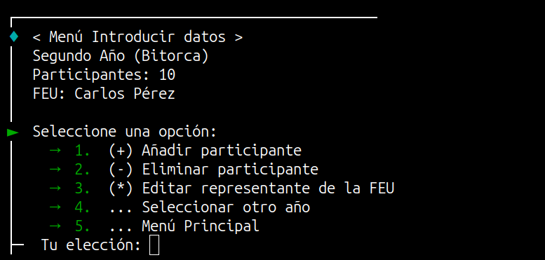
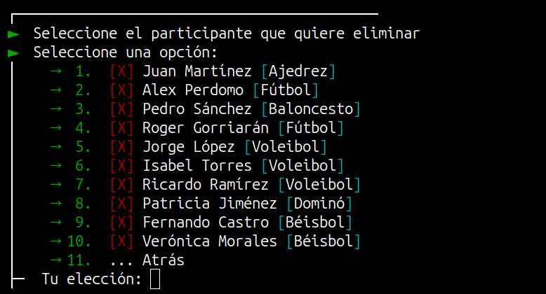
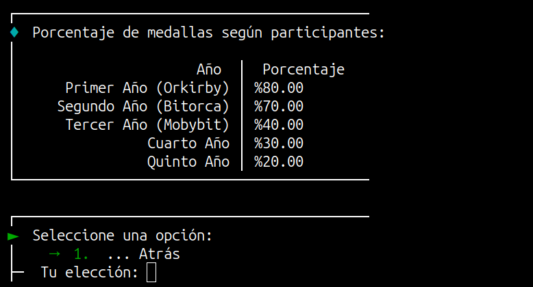

# Tarea Final IP 🎓

Pequeño repositorio que aloja mi solución de la Tarea Final de [Introducción a la Programación](https://moodle.cujae.edu.cu/course/info.php?id=895) del curso 2024-2025 en la [CUJAE](https://cujae.edu.cu) 🚀

## Capturas 📸

  
  
  
  

## Enunciado de la Tarea 📋

**Tema #13**

De los juegos Interaños de la facultad se conoce por cada año el responsable de la FEU de deportes, la cantidad de medallas obtenidas, y el nombre, sexo y deporte de cada uno de los participantes del año. Confeccione una aplicación que permita determinar:

1. 🥇 El año que ganó más medallas.
2. 📊 Un reporte con todos los datos de los años.
3. 📈 El por ciento de medallas obtenidas por cada año según la cantidad de participantes.
4. 👩‍🤝‍👨 Determinar la cantidad de años en que la cifra de las mujeres supera a la de los hombres.
5. ⚽ Dado un año y un deporte, devolver los participantes.

## Bibliografía 📚

[H. M. Deitel y P. J. Deitel, Cómo programar en C/C++ y Java, 4th ed. Pearson Educación, 2004.](https://moodle.uneg.edu.ve/pluginfile.php/269584/mod_resource/content/1/Como%20Programar%20en%20C%2B%2B%20y%20en%20Java.pdf)

## IDE Orientado para la tarea 💻

[QT v5.3.2](https://download.qt.io/new_archive/qt/5.3/5.3.2/)
